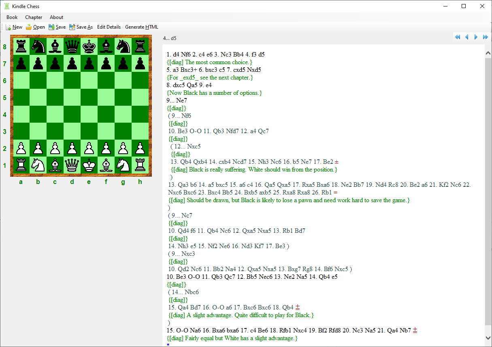

# Kindle Chess 3

This project contains a tool to create Kindle books on Chess.

**This version has been converted to use F# 5 and NET 6.0 and uses PGN as the means of storing the main elements of the games and descriptions.**

## Maintainer(s)

- [Phil Brooks](https://github.com/Phil-Brooks)
